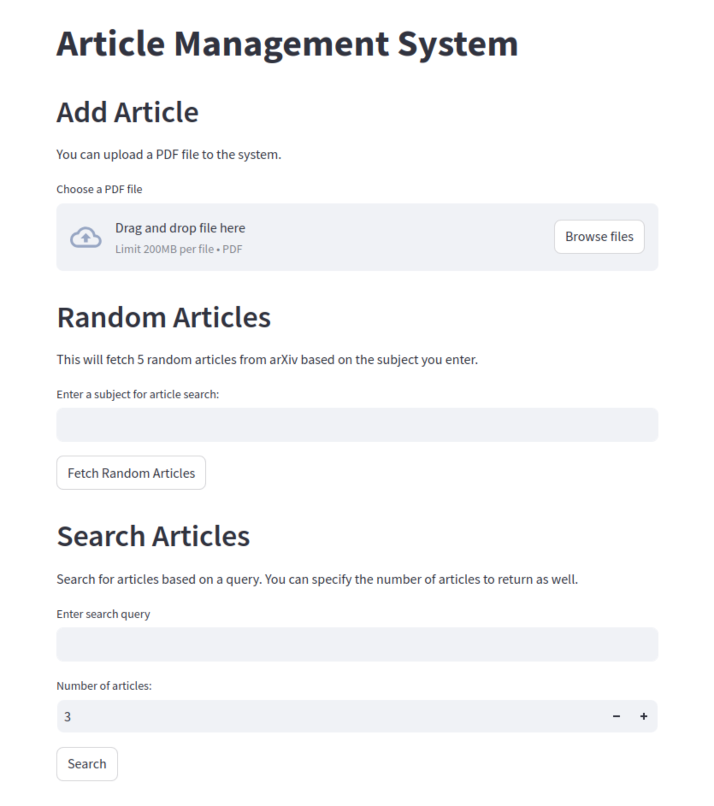

# Article Management Application

This repository contains an application for managing articles. Follow the instructions below to get the project up and running.



## Getting Started

### Prerequisites

- [Docker](https://www.docker.com/) installed on your machine
- [Git](https://git-scm.com/) for cloning the repository

### Installation

1. **Clone the repository:**
    ```bash
    git clone https://github.com/metsearch/article-manager-system
    ```

2. **Navigate to the project directory:**
    ```bash
    cd articles-manager
    ```

3. **Create an environment file:**
    ```bash
    touch api/.env
    ```

4. **Add necessary environment variables to the `.env` file.**  
   *(Feel free to contact me if you need more details about the required environment variables.)*

5. **Build and run the project using Docker:**
    ```bash
    docker compose up --build
    ```

## Accessing the Application

Once the containers are up, you can access the different components of the application:

- **FastAPI Server**: [http://localhost:8100/](http://localhost:8100/)
- **Qdrant**: [http://localhost:9200/](http://localhost:6333/dashboard)
- **Streamlit Client**: [http://localhost:8501/](http://localhost:8501/)

---

Feel free to reach out for any questions or further clarifications.
